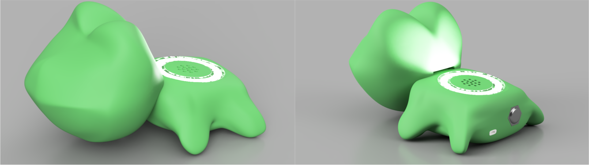

# 🎨 Colour Quest — COMP4447 Summer 2024

**University of Sydney – Interaction Design (COMP4447)**  
[🌐 GitHub Repo](https://github.com/c1h1r1i1s1/comp4447) | [📺 Project Demo Video](https://www.youtube.com/watch?v=YOUR_VIDEO_ID)

---

## 🌱 Challenge Statement

> **How can we use technology to help children connect and engage with the aesthetic beauty of nature in a playful and creative manner?**

---

## 🐸 Project Summary

**Colour Quest** is an interactive outdoor game designed to help children engage with the natural world through colour exploration and creativity. Housed in a friendly frog-shaped handheld device, the game promotes play, learning, and artistic expression.

### 🎮 Game Modes

#### 1. **Colour Hunt**  
Search for specific colours in nature!  
- Scan real-world objects and receive a score based on how closely the colours match.  
- Includes **two difficulty modes** for different age groups.  
- **Colour-blind accessibility modes** built in.

#### 2. **Colour Palette** *(WiFi required)*  
Capture colours from the environment to build your palette.  
- Once a palette is complete, the frog recommends a **creative scene** to draw using your found colours.  
- Uses the **built-in speaker** for fun audio prompts.  
- Encourages **open-ended creativity**.

---

## 🤝 Collaborative Play

Both game modes are designed with collaboration in mind, allowing friends to play together and discover colours as a team.

---

## 🌈 Why It Matters

Colour Quest helps children:
- Connect with nature meaningfully  
- Develop colour recognition and perception skills  
- Express creativity through drawing and exploration  
- Play cooperatively in the outdoors

---

## 📷 Hardware Design

Our custom-designed frog-shaped device includes:
- Colour sensor  
- Audio output speaker  
- Physical interface buttons  
- WiFi connectivity for palette-based prompts  
- Rechargeable battery with USB-C port  

---

## 📎 Resources

- 🔗 [GitHub Repository](https://github.com/c1h1r1i1s1/comp4447)
- 📺 [Demo Video on YouTube](https://www.youtube.com/watch?v=YOUR_VIDEO_ID) *(replace with your link)*
- 🖼️ Image courtesy of our 3D CAD design, showing the prototype form

---

## 📝 License

This project is licensed under the [MIT License](LICENSE).

---
